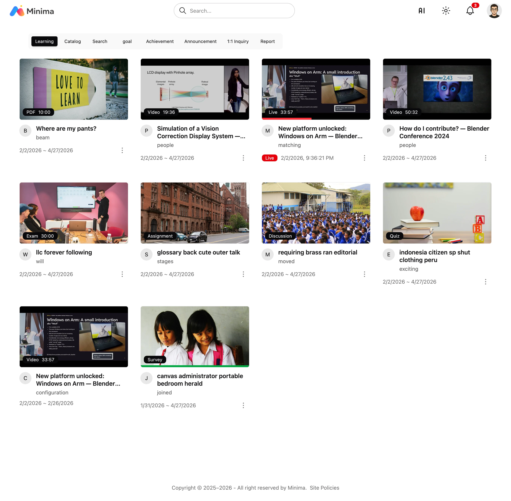
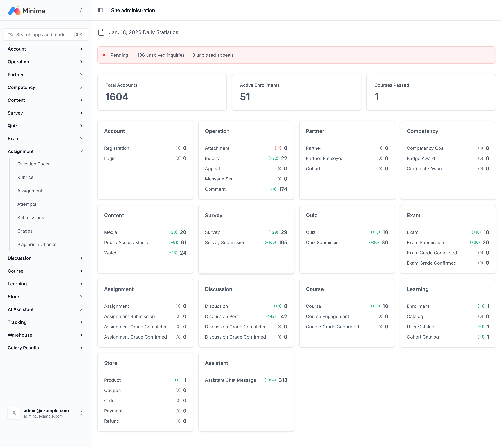

# Minima LMS

[](README.md)
[](README-ko.md)
[](https://opensource.org/licenses/MIT)


**마이크로 러닝 LMS. Moodle, Canvas, Open edX 대안.**

**🚀 알파 릴리스**: 핵심 기능 ready. 테스트와 피드백 환영합니다!

## 설계 의도

- **날짜가 있는 콘텐츠 재사용** - 날짜 정보를 포함한 콘텐츠를 중복이나 수정 없이 재사용 가능
- **계층적 권한 시스템** - 중첩된 콘텐츠에 대한 세밀한 접근 제어
- **비트맵 기반 시청 추적** - 단순 완료 여부가 아닌 실제 시청/스킵 패턴까지 정확하게 추적
- **자막 기반 검색** - 텍스트로 콘텐츠를 검색하고 해당 시간으로 바로 이동

이러한 설계는 실제로 잘 작동하고 있습니다.
예를 들어, 라이브 세션 참석을 추적할 때 입장, 대기, 세션 시작, 일시 퇴장, 재입장 같은 이벤트가 발생해도 서버 측에 예외 처리 코드를 추가하지 않아도 모든 엣지 케이스를 처리합니다.

## 문서

[https://cobel1024.github.io/minima-docs/](https://cobel1024.github.io/minima-docs/)

## 빠른 시작

```bash
git clone https://github.com/cobel1024/minima && cd minima
sh dev.sh up
```

접속 username `admin@example.com` / password `1111`

- 학습자: [http://localhost:5173](http://localhost:5173)
- 어드민: [http://localhost:8000](http://localhost:8000/admin/)

## 스크린샷




## 기술 스택

- Python 3.14, Django 6, Django-ninja, Django-unfold
- SolidJS, TypeScript, Vite, daisyUI, Tailwind CSS, Tiptap
- PostgreSQL, Redis, Celery, OpenSearch, Apache Tika

## 기여

이슈와 풀 리퀘스트 환영. 개발 환경 설정은 [개발](#개발) 섹션을 참고해 주세요.

## 개발

- [코어 개발](core/README.md)
- [학습자 개발](student/README.md)

## 라이선스

MIT License - [LICENSE](core/LICENSE) 참고

### 저작자 표시

데모 콘텐츠는 [Blender Foundation](https://www.blender.org/)의 동영상 및 3D 모델을 포함하며, [Creative Commons Attribution 4.0 International](https://creativecommons.org/licenses/by/4.0/) 라이선스를 따릅니다.
