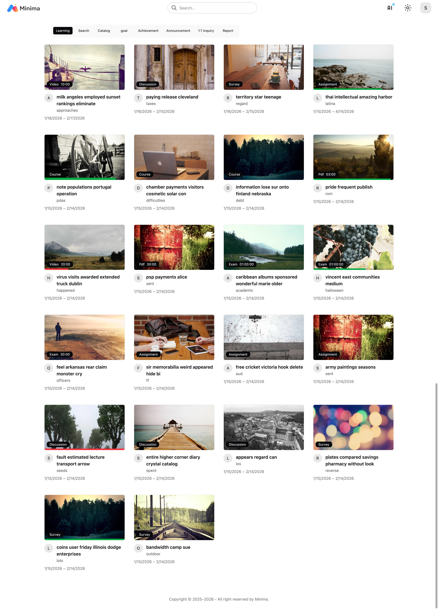

# Minima LMS

[](README.md)
[](README-ko.md)
[](https://opensource.org/licenses/MIT)

Modern micro-learning LMS.
Lightweight alternative to Moodle, Canvas, and Open edX.

> **🚧 Pre-Release**: Not ready for production use yet

## Documentation

[https://cobel1024.github.io/minima-docs/](https://cobel1024.github.io/minima-docs/)

## Quick Start

```bash
git clone https://github.com/cobel1024/minima && cd minima
chmod +x dev.sh
./dev.sh up
```

Access with username `admin@example.com` and password `1111`

- student: [http://localhost:5173](http://localhost:5173)
- admin: [http://localhost:8000](http://localhost:8000/admin/)

## Screenshots




## Tech Stack

### Backend

- Django 6.x, Django Ninja, Django-unfold
- PostgreSQL, OpenSearch, Redis, MinIO
- AI Plugin Architecture, Gemini/OpenAI/Anthropic

### Frontend

- SolidJS + TypeScript
- TanStack Router, TailwindCSS 4
- Plyr, PDFSlick, TipTap

## Development

- [Core Development](core/README.md)
- [Student Development](student/README.md)

## License

MIT License - see [LICENSE](core/LICENSE)
