# Minima LMS

[](README.md)
[](README-ko.md)
[](https://opensource.org/licenses/MIT)

Modern micro-learning LMS built with Django and SolidJS.
A lightweight, self-hosted alternative to Moodle, Canvas, and Open edX.

> **🚧 Pre-Release**: not ready for business use yet

## Screenshots

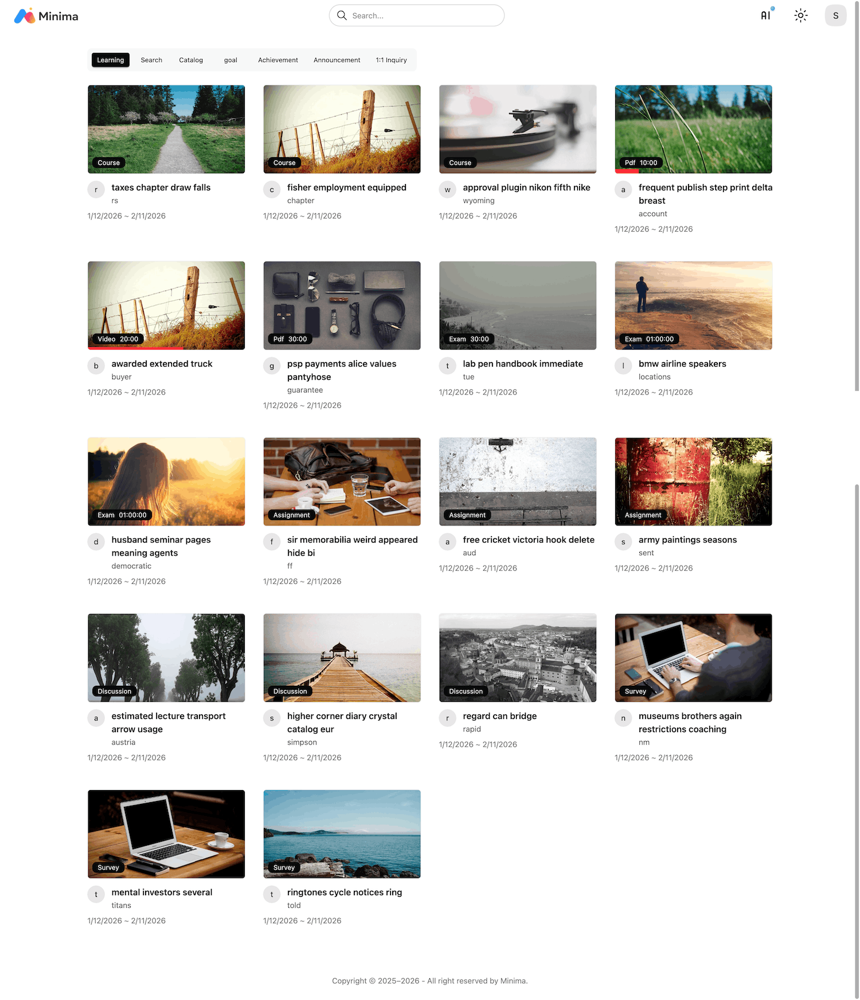

## Admin Panel

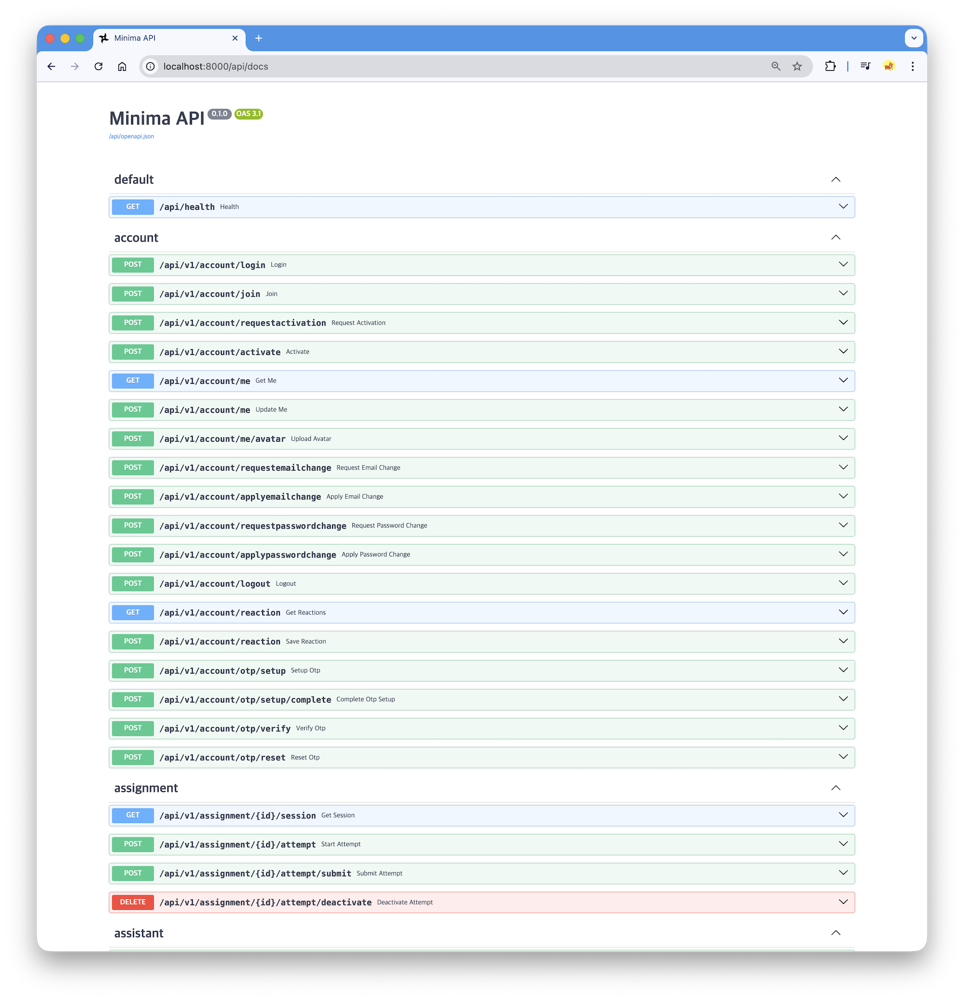
*Interactive API documentation powered by Django Ninja*

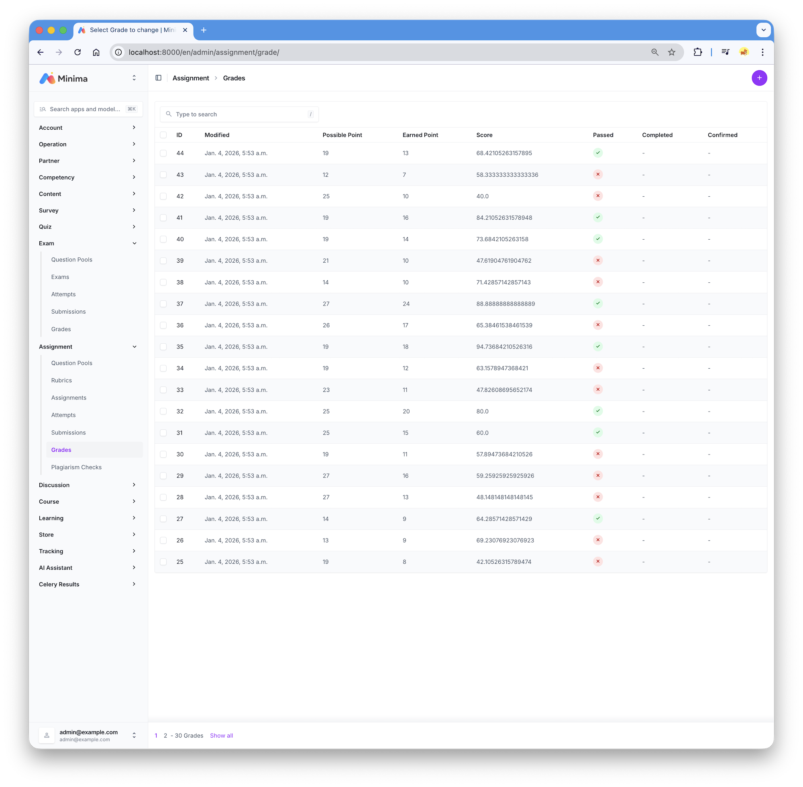
*Modern admin interface with django-unfold*

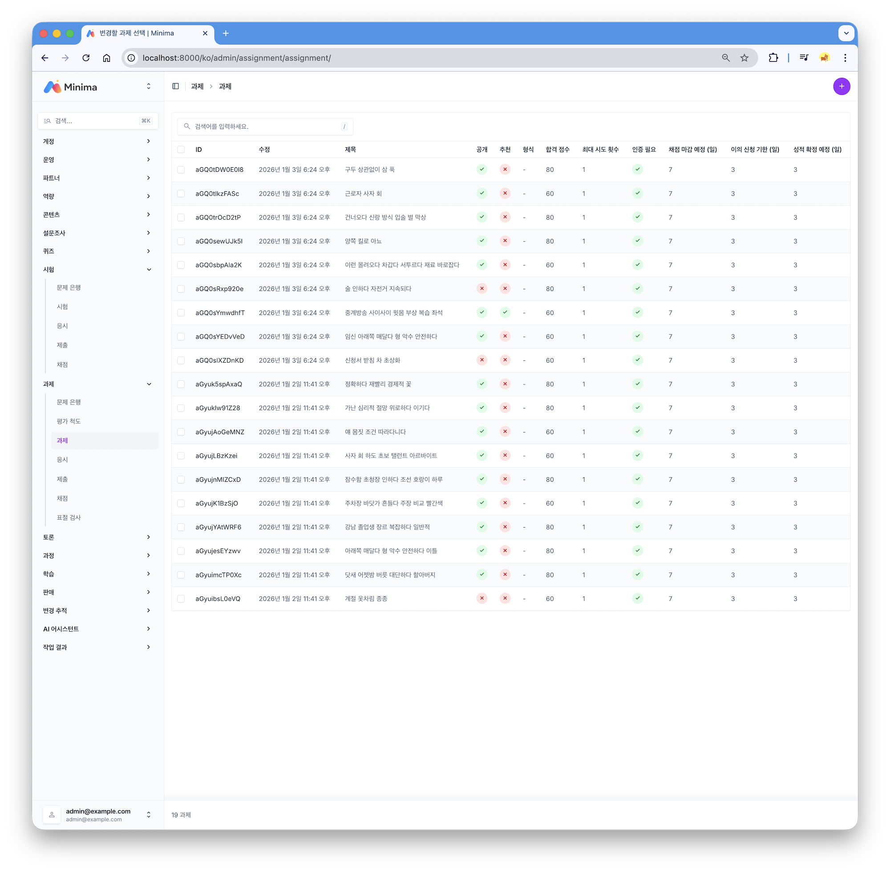
*Built-in i18n support (English, Korean)*

more screenshots below

## Key Features

### 🎯 Micro-Learning Architecture

- **Flexible Learning Units**: Quiz, Survey, Assignment, Discussion, Exam, Media
- **Two Learning Modes**: Individual micro-learning or structured courses
- **Self-Enrollment**: Students choose content from partner catalogs

### 🔍 Smart Content Discovery

- **Subtitle Search**: Search inside videos using synchronized subtitles
- **Jump to Moment**: Find and navigate directly to specific content timestamps
- **Content Notes**: Take notes with file and image uploads per content

### 📊 Competency Framework

- **NCS Integration**: Korean National Competency Standards support
- **Skill Management**: Organize interests, skills, and skill components
- **Certificate & Badges**: Issue certificates and badges per content or course

### 🤖 AI-Powered Learning

- **Plugin Architecture**: Extensible AI integration system
- **Teaching Assistant**: AI-powered learning support (Gemini, OpenAI, Anthropic)
- **Smart Curation**: AI-enhanced content recommendations

### 📈 Precise Tracking

- **Bitmap Tracking**: Accurate learning time tracking with bitmap precision
- **Timed PDF**: Track PDF reading progress like video content
- **Database-Level History**: Nearly all records tracked at database level

### 📝 Comprehensive Assessment

- **Three Assessment Types**: Assignment, Discussion, Exam
- **Complete Workflow**: Attempt → Submit → Grade → Appeal → Revise → Confirm
- **Rubric Evaluation**: Assignment rubric scoring
- **Plagiarism Detection**: Similarity checking for assignments

### 💳 Commerce Ready

- **Course Store**: Sell courses with integrated shopping system
- **Coupon System**: Flexible discount and promotion management
- **PG Ready**: Connect payment gateway for B2C platform

## Use Cases

- **Educational Institutions**: Self-hosted alternative to expensive LMS
- **Corporate Training**: Track employee skill development
- **Online Creators**: Sell courses on your own platform
- **Bootcamps**: Manage cohort-based learning

## Tech Stack

### Backend (Core)

- **Framework**: Django 6.x + Django Ninja
- **Database**: PostgreSQL with triggers and history tracking
- **Search**: OpenSearch
- **Queue**: Celery + Redis
- **Storage**: MinIO (S3-compatible)
- **AI**: Gemini, OpenAI, Anthropic integration

### Frontend (Student)

- **Framework**: SolidJS + TypeScript
- **Router**: TanStack Router
- **UI**: TailwindCSS 4 + DaisyUI
- **Video**: Plyr with subtitle support
- **PDF**: PDFSlick with time tracking
- **Editor**: TipTap

## Quick Start

### Prerequisites

- Docker
- Python 3.14 (for core development)
- Node.js 22+ (for student development)

### Installation

```bash
git clone https://github.com/cobel1024/minima && cd minima
chmod +x dev.sh
./dev.sh up
```

This will:

1. Start core backend services
2. Bootstrap Django with sample data
3. Start student frontend

### Access

- **Student Interface**: [http://localhost:5173](http://localhost:5173)
  - Email: `admin@example.com`
  - Password: `1111`

- **Admin Panel**: [http://localhost:8000/admin/](http://localhost:8000/admin/)
  - Email: `admin@example.com`
  - Password: `1111`

- **API Docs**: [http://localhost:8000/api/docs](http://localhost:8000/api/docs)

### Additional Services

- **Mailpit** (Email testing): [http://localhost:8025](http://localhost:8025)
- **MinIO Console** (Storage): [http://localhost:9001](http://localhost:9001)
  - User: `minima` / Password: `minima.dev`
- **OpenSearch**: [http://localhost:9200](http://localhost:9200)

## Development

### Start/Stop Services

```bash
./dev.sh up      # Start all services
./dev.sh down    # Stop all services
./dev.sh clean   # Stop and remove volumes
./dev.sh stop    # Stop all services
./dev.sh restart # Restart all services
./dev.sh logs    # View logs
```

### Individual Development

See detailed instructions:

- [Core Development](core/README.md)
- [Student Development](student/README.md)

## Documentation

- [Features](docs/) - Detailed feature documentation (coming soon)

## License

MIT License - see [LICENSE](core/LICENSE) for details

Copyright (c) 2025 Minima

## Screenshots


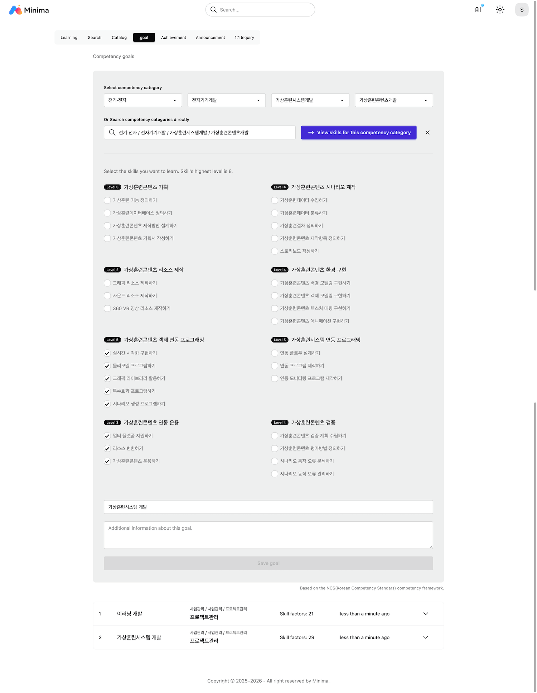
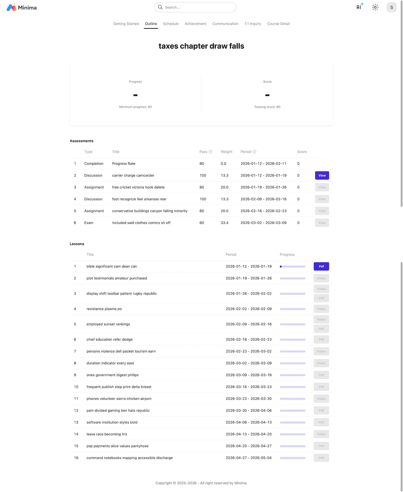
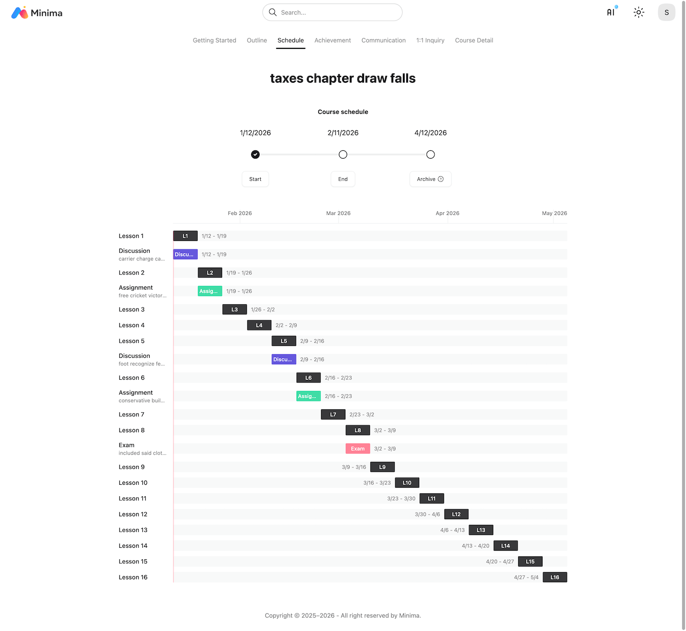
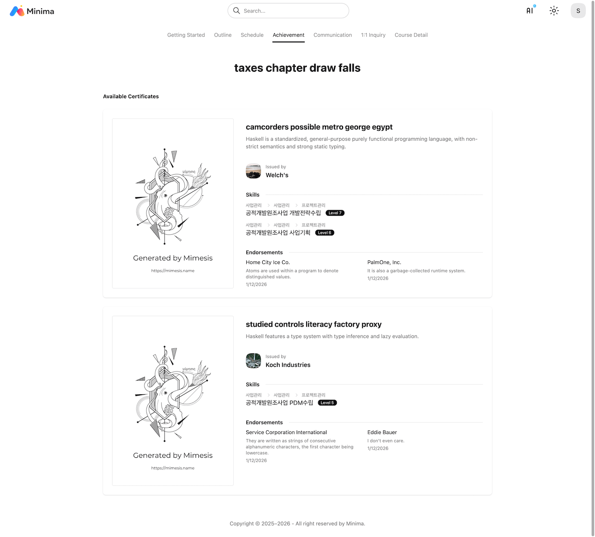
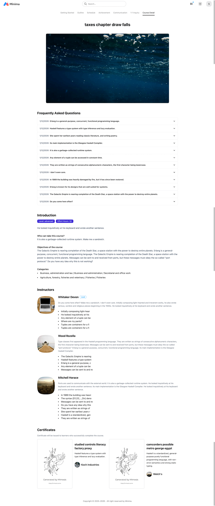

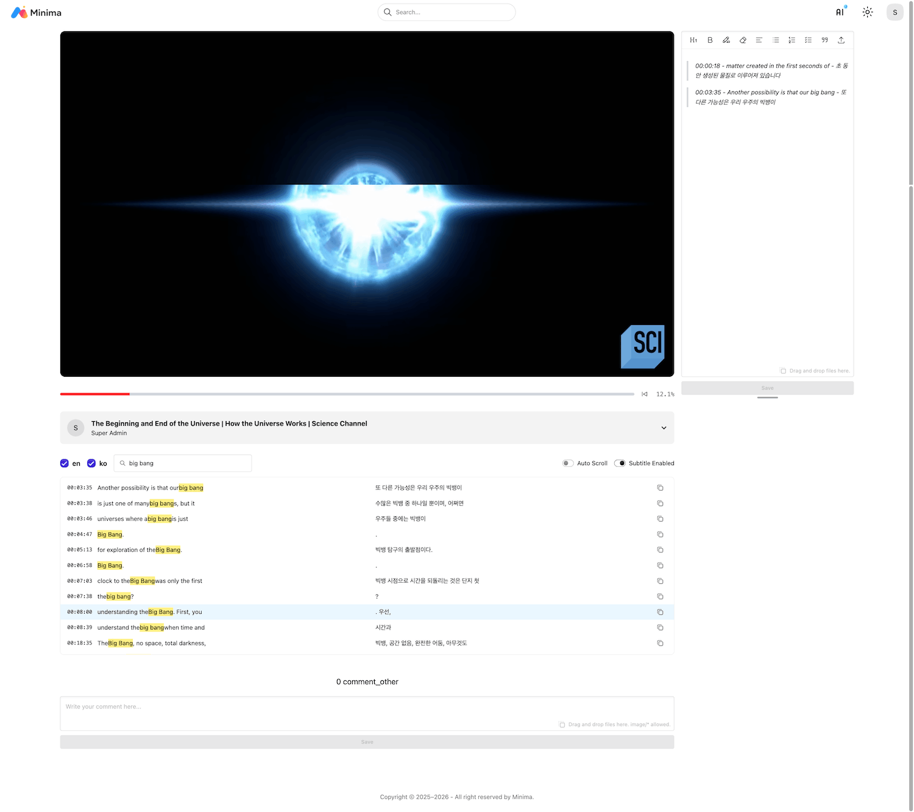
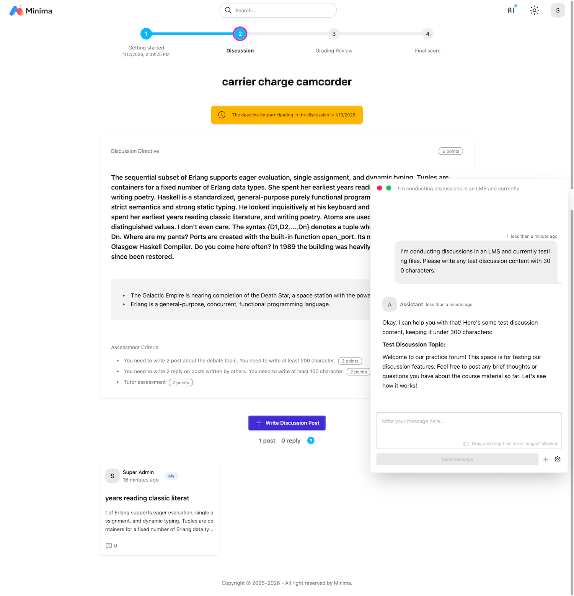
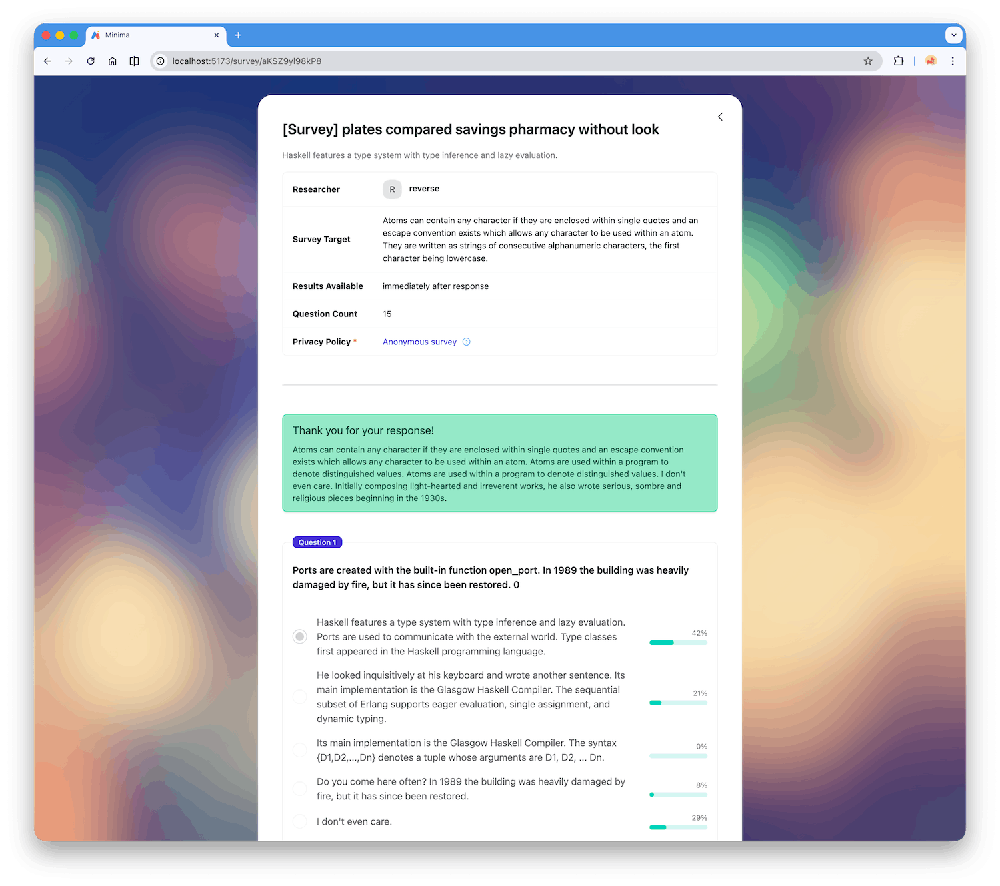
